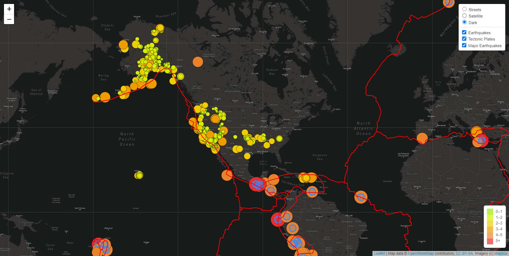
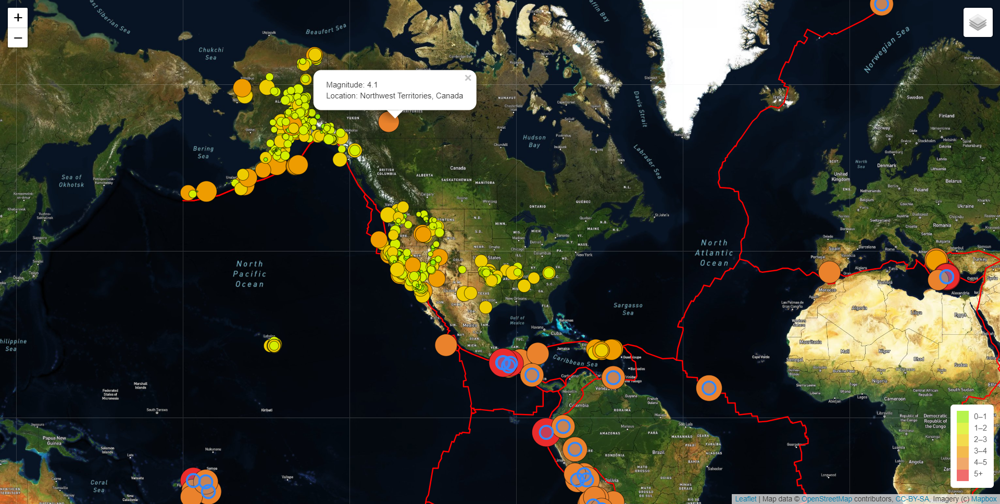
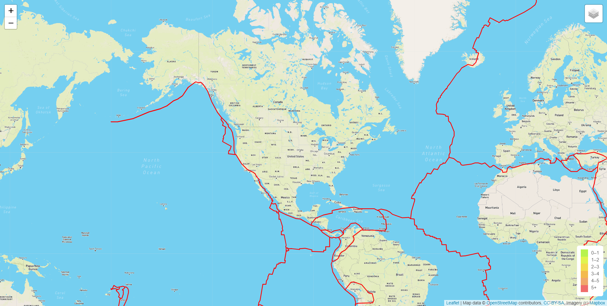

# Mapping_Earthquakes

## Overview
Mapping Earthquakes project is an insighful data visualization map with interactive features on earthquakes around the world. The goal of the project is to make earthquake maps informative and easy to use on Desktop and mobile phones to generate position buzz about disaster reporting network.

## Approach
The latest earthquake data is retrieved from US Geological Survey website in GeoJSON format. Following links were used to get the latest data.

[All Earthquakes within last 7 days](https://earthquake.usgs.gov/earthquakes/feed/v1.0/summary/all_week.geojson)

[Earthquakes with magnitudes more than 4.5](https://earthquake.usgs.gov/earthquakes/feed/v1.0/summary/4.5_week.geojson)

[Tectonic plate data](https://raw.githubusercontent.com/fraxen/tectonicplates/master/GeoJSON/PB2002_boundaries.json)

The data is then traversed through using Javascript and D3 and Leaflet libraries. 

Plotting of the data on Map is done using MapBox API request.

## Map Features

- Map is made interactive using the tiles at upper right hand corner to allow users to toggle between different map styles to view the data. User are able to choose one or all the data options from All Earthquakes, Tectonic Plates and Earthquakes with magnitudes more than 4.5.

- Three map style options are provided: Street view (default), Satellite view and Dark view.
  
- On the map, earthquakes are displayed as circles with varying sizes and colors. The diameter and color of each earthquake is representative of the magnitude of the earthquake. 

- Earthquakes with larger magnitudes appear in larger and darker in color with the legend providing the context for the map data.

- Magnitude and location of each earthquake is shown as a popup marker.

- To illustrate relationship between location and frequency of seismic activity and tectonic plates, fault lines are added to the map.
  

## Map Images

View of the image with all 3 data using Dark Map Style:

Satellite view of earthquakes with Popup markers:

Street view of Tectonic Plates data:

